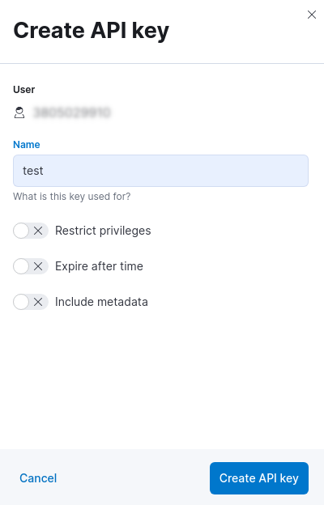

Elasticsearch PHP client
========================

[](https://github.com/elastic/elasticsearch-php/actions) [](https://packagist.org/packages/elasticsearch/elasticsearch) [](https://packagist.org/packages/elasticsearch/elasticsearch)

This is the official PHP client for 
[Elasticsearch](https://www.elastic.co/elasticsearch/).

## Contents

- [Getting started](#getting-started-)
- [Configuration](#configuration)
  - [Use Elastic Cloud](#use-elastic-cloud)
- [Usage](#usage)
  - [Index a document](#index-a-document)
  - [Search a document](#search-a-document)
  - [Delete a document](#delete-a-document)
- [Versioning](#versioning)
- [Backward Incompatible Changes](#backward-incompatible-changes-boom)
- [Mock the Elasticsearch client](#mock-the-elasticsearch-client)
- [FAQ](#faq-)
- [Contribute](#contribute-)
- [License](#license-)

***

## Getting started 🐣

Using this client assumes that you have an 
[Elasticsearch](https://www.elastic.co/elasticsearch/) server installed and 
running.

You can install the client in your PHP project using 
[composer](https://getcomposer.org/):

```bash
composer require elasticsearch/elasticsearch
```

After the installation you can connect to Elasticsearch using the 
`ClientBuilder` class. For instance, if your Elasticsearch is running on 
`localhost:9200` you can use the following code:

```php

use Elastic\Elasticsearch\ClientBuilder;

$client = ClientBuilder::create()
    ->setHosts(['localhost:9200'])
    ->build();

// Info API
$response = $client->info();

echo $response['version']['number']; // 8.0.0
```

The `$response` is an object of `Elastic\Elasticsearch\Response\Elasticsearch`
class that implements `ElasticsearchInterface`, PSR-7 
[ResponseInterface](https://www.php-fig.org/psr/psr-7/#33-psrhttpmessageresponseinterface)
and [ArrayAccess](https://www.php.net/manual/en/class.arrayaccess.php).

This means the `$response` is a [PSR-7](https://www.php-fig.org/psr/psr-7/)
object:

```php
echo $response->getStatusCode(); // 200
echo (string) $response->getBody(); // Response body in JSON
```

and also an "array", meaning you can access the response body as an
associative array, as follows:


```php
echo $response['version']['number']; // 8.0.0

var_dump($response->asArray());  // response body content as array
```

Moreover, you can access the response body as object, string or bool:

```php
echo $response->version->number; // 8.0.0

var_dump($response->asObject()); // response body content as object
var_dump($response->asString()); // response body as string (JSON)
var_dump($response->asBool());   // true if HTTP response code between 200 and 300
```

## Configuration

Elasticsearch 8.0 offers 
[security by default](https://www.elastic.co/blog/introducing-simplified-elastic-stack-security),
that means it uses [TLS](https://en.wikipedia.org/wiki/Transport_Layer_Security)
for protect the communication between client and server.

In order to configure `elasticsearch-php` for connecting to Elasticsearch 8.0 we
need to have the certificate authority file (CA).

You can install Elasticsearch in different ways, for instance using 
[Docker](https://www.elastic.co/guide/en/elasticsearch/reference/current/docker.html)
you need to execute the followind command:

```bash
docker pull docker.elastic.co/elasticsearch/elasticsearch:8.0.1
```
Once you have the docker image installed, you can execute Elasticsearch, for 
instance using a single-node cluster configuration, as follows:

```bash
docker network create elastic
docker run --name es01 --net elastic -p 9200:9200 -p 9300:9300 -it docker.elastic.co/elasticsearch/elasticsearch:8.0.1
```

This command creates an `elastic` Docker network and start Elasticsearch
using the port `9200` (default).

When you run the docker image a password is generated for the `elastic` user
and it's printed to the terminal (you might need to scroll back a bit in the 
terminal to view it). You have to copy it since we will need to connect to 
Elasticsearch.

Now that Elasticsearch is running we can get the `http_ca.crt` file certificate.
We need to copy it from the docker instance, using the following command:

```bash
docker cp es01:/usr/share/elasticsearch/config/certs/http_ca.crt .
```

Once we have the `http_ca.crt` certificate and the `password`, copied during the
start of Elasticsearch, we can use it to connect with `elasticsearch-php` as 
follows:

```php
$client = ClientBuilder::create()
    ->setHosts(['https://localhost:9200'])
    ->setBasicAuthentication('elastic', 'password copied during Elasticsearch start')
    ->setCABundle('path/to/http_ca.crt')
    ->build();
```

For more information about the Docker configuration of Elasticsearch you can
read the official documentation 
[here](https://www.elastic.co/guide/en/elasticsearch/reference/current/docker.html).

### Use Elastic Cloud

You can use [Elastic Cloud](https://www.elastic.co/cloud/) as server with 
`elasticsearch-php`. Elastic Cloud is the PaaS solution offered by 
[Elastic](https://www.elastic.co).

For connecting to Elastic Cloud you just need the `Cloud ID` and the `API key`.

You can get the `Cloud ID` from the `My deployment` page of your dashboard (see 
the red rectangle reported in the screenshot).


You can generate an `API key` in the `Management` page under the section 
`Security`.


When you click on `Create API key` button you can choose a name and set the 
other options (for example, restrict privileges, expire after time, and so on).



After this step you will get the `API key`in the API keys page. 


**IMPORTANT**: you need to copy and store the `API key`in a secure place, since 
you will not be able to view it again in Elastic Cloud.

Once you have collected the `Cloud ID` and the `API key`, you can use 
`elasticsearch-php` to connect to your Elastic Cloud instance, as follows:

```php
$client = ClientBuilder::create()
    ->setElasticCloudId('insert here the Cloud ID')
    ->setApiKey('insert here the API key')
    ->build();
```

## Usage

The `elasticsearch-php` client offers 400+ endpoints for interacting with 
Elasticsearch. A list of all these endpoints is available in the 
[official documentation](https://www.elastic.co/guide/en/elasticsearch/reference/current/rest-apis.html)
of Elasticsearch APIs.

Here we reported the basic operation that you can perform with the client: 
index, search and delete.

### Index a document

You can store (index) a JSON document in Elasticsearch using the following code:

```php
use Elastic\Elasticsearch\Exception\ClientResponseException;
use Elastic\Elasticsearch\Exception\ServerResponseException;

$params = [
    'index' => 'my_index',
    'body'  => [ 'testField' => 'abc']
];

try {
  $response = $client->index($params);
} catch (ClientResponseException $e) {
  // manage the 4xx error
} catch (ServerResponseException $e) {
  // manage the 5xx error
} catch (Exception $e) {
  // eg. network error like NoNodeAvailableException
}

print_r($response->asArray());  // response body content as array
```

Elasticsearch stores the `{"testField":"abc"}` JSON document in the `my_index` 
index. The `ID` of the document is created automatically by Elasticsearch and 
stored in `$response['_id']` field value. If you want to specify an `ID` for the 
document you need to store it in `$params['id']`.

You can manage errors using `ClientResponseException` and 
`ServerResponseException`. The PSR-7 response is available using 
`$e->getResponse()` and the HTTP status code is available using `$e->getCode()`.

### Search a document

Elasticsearch provides many different way to search documents. The simplest 
search that you can perform is a 
[match query](https://www.elastic.co/guide/en/elasticsearch/reference/current/query-dsl-match-query.html),
as follows:

```php
$params = [
    'index' => 'my_index',
    'body'  => [
        'query' => [
            'match' => [
                'testField' => 'abc'
            ]
        ]
    ]
];
$response = $client->search($params);

printf("Total docs: %d\n", $response['hits']['total']['value']);
printf("Max score : %.4f\n", $response['hits']['max_score']);
printf("Took      : %d ms\n", $response['took']);

print_r($response['hits']['hits']); // documents
```

Using Elasticsearch you can perform different query search, for more information 
we suggest toread the official documention reported 
[here](https://www.elastic.co/guide/en/elasticsearch/reference/current/search-your-data.html).

### Delete a document

You can delete a document specifing the `index` name and the `ID` of the 
document, as follows:

```php
use Elastic\Elasticsearch\Exception\ClientResponseException;

try {
    $response = $client->delete([
        'index' => 'my_index',
        'id' => 'my_id'
    ]);
} catch (ClientResponseException $e) {
    if ($e->getCode() === 404) {
        // the document does not exist
    }
}
if ($response['acknowledge'] === 1) {
    // the document has been delete
}
```

For more information about the Elasticsearch REST API you can read the official 
documentation [here](https://www.elastic.co/guide/en/elasticsearch/reference/current/rest-apis.html).

### Versioning

This client is versioned and released alongside Elasticsearch server.

To guarantee compatibility, use the most recent version of this library within 
the major version of the corresponding Enterprise Search implementation.

For example, for Elasticsearch `7.16`, use `7.16` of this library or above, but 
not `8.0`.

## Backward Incompatible Changes :boom:

The 8.0.0 version of `elasticsearch-php` contains a new implementation compared 
with 7.x. It supports [PSR-7](https://www.php-fig.org/psr/psr-7/) for HTTP 
messages and [PSR-18](https://www.php-fig.org/psr/psr-18/) for HTTP client 
communications. 

We tried to reduce the BC breaks as much as possible with `7.x` but there are 
some (big) differences:

- we changed the namespace, now everything is under `Elastic\Elasticsearch`
- we used the 
  [elastic-transport-php](https://github.com/elastic/elastic-transport-php) 
  library for HTTP communications;
- we changed the `Exception` model, using the namespace 
  `Elastic\Elasticsearch\Exception`. All the exceptions extends the 
  `ElasticsearchException` interface, as in 7.x
- we changed the response type of each endpoints using an 
  [Elasticsearch](src/Response/Elasticsearch.php) response class. This class 
  wraps a a [PSR-7](https://www.php-fig.org/psr/psr-7/) response allowing the 
  access of the body response as array or object. This means you can access the 
  API response as in 7.x, no BC break here! :angel:
- we changed the `ConnectionPool` in `NodePool`. The `connection` naming was 
  ambigous since the objects are nodes (hosts)

You can have a look at the [BREAKING_CHANGES](BREAKING_CHANGES.md) file for more 
information.

## Mock the Elasticsearch client

If you need to mock the Elasticsearch client you just need to mock a
[PSR-18](https://www.php-fig.org/psr/psr-18/) HTTP Client.

For instance, you can use the 
[php-http/mock-client](https://github.com/php-http/mock-client) as follows:

```php
use Elastic\Elasticsearch\ClientBuilder;
use Elastic\Elasticsearch\Response\Elasticsearch;
use Http\Mock\Client;
use Nyholm\Psr7\Response;

$mock = new Client(); // This is the mock client

$client = ClientBuilder::create()
    ->setHttpClient($mock)
    ->build();

// This is a PSR-7 response
$response = new Response(
    200, 
    [Elasticsearch::HEADER_CHECK => Elasticsearch::PRODUCT_NAME],
    'This is the body!'
);
$mock->addResponse($response);

$result = $client->info(); // Just calling an Elasticsearch endpoint

echo $result->asString(); // This is the body!
```

We are using the `ClientBuilder::setHttpClient()` to set the mock client.
You can specify the response that you want to have using the 
`addResponse($response)` function. As you can see the `$response` is a PSR-7 
response object. In this example we used the `Nyholm\Psr7\Response` object from 
the [nyholm/psr7](https://github.com/Nyholm/psr7) project. If you are using 
[PHPUnit](https://phpunit.de/) you can even mock the `ResponseInterface` as 
follows:

```php
$response = $this->createMock('Psr\Http\Message\ResponseInterface');
```

**Notice**: we added a special header in the HTTP response. This is the product 
check header, and it is required for guarantee that `elasticsearch-php` is 
communicating with an Elasticsearch server 8.0+.

For more information you can read the 
[Mock client](https://docs.php-http.org/en/latest/clients/mock-client.html) 
section of PHP-HTTP documentation.

## FAQ 🔮

### Where do I report issues with the client?

If something is not working as expected, please open an 
[issue](https://github.com/elastic/elasticsearch-php/issues/new).

### Where else can I go to get help?

You can checkout the 
[Elastic community discuss forums](https://discuss.elastic.co/).

## Contribute 🚀

We welcome contributors to the project. Before you begin, some useful info...

+ If you want to contribute to this project you need to subscribe to a 
  [Contributor Agreement](https://www.elastic.co/contributor-agreement).
+ Before opening a pull request, please create an issue to 
  [discuss the scope of your proposal](https://github.com/elastic/elasticsearch-php/issues).
+ If you want to send a PR for version `8.0` please use the `8.0` branch, for 
  `8.1` use the `8.1` branch and so on. 
+ Never send PR to `master` unless you want to contribute to the development 
  version of the client (`master` represents the next major version).
+ Each PR should include a **unit test** using [PHPUnit](https://phpunit.de/). 
  If you are not familiar with PHPUnit you can have a look at the 
  [reference](https://phpunit.readthedocs.io/en/9.5/). 

Thanks in advance for your contribution! :heart:

## License 📗

[MIT](LICENSE) © [Elastic](https://www.elastic.co/)
