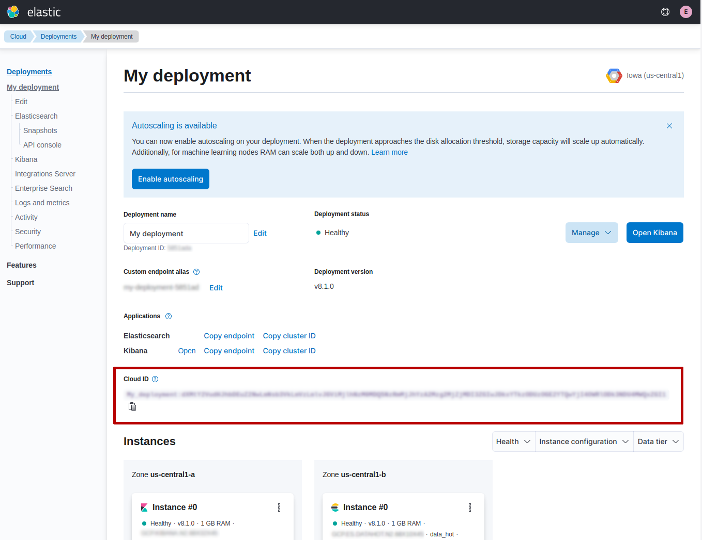
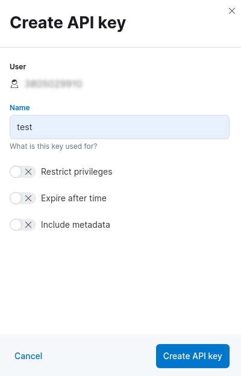

---
mapped_pages:
  - https://www.elastic.co/guide/en/elasticsearch/client/php-api/current/connecting.html
---

# Connecting [connecting]

This page contains the information you need to connect and use the Client with {{es}}.

## Elastic Cloud [auth-ec]

You can connect to [Elastic Cloud](https://www.elastic.co/cloud/) using an ***API key*** and a ***Cloud ID***:

```php
$client = ClientBuilder::create()
   ->setElasticCloudId('<cloud-id>')
   ->setApiKey('<api-key>')
   ->build();
```

Where <cloud-id> and <api-key> can be retrieved using the Elastic Cloud web UI.

You can get the `Cloud ID` from the `My deployment` page of your dashboard (see the red rectangle reported in the screenshot).



You can generate an `API key` in the `Management` page under the section `Security`.


When you click on `Create API key` button you can choose a name and set the other options (eg. restrict privileges, expire after time, etc).



After this step you will get the `API key`in the API keys page.


***IMPORTANT***: you need to copy and store the `API key`in a secure place, since you will not be able to view it again in Elastic Cloud.


## Security by default (HTTPS) [auth-http]

{{es}} 8.0 offers [security by default](https://www.elastic.co/blog/introducing-simplified-elastic-stack-security), that means it uses [TLS](https://en.wikipedia.org/wiki/Transport_Layer_Security) for protect the communication between client and server.

In order to configure `elasticsearch-php` for connecting to {{es}} 8.0 we need to have the certificate authority file (CA).

You can install {{es}} in different ways, for instance using [Docker](docs-content://deploy-manage/deploy/self-managed/install-elasticsearch-with-docker.md) you need to execute the followind command:

```shell
docker pull docker.elastic.co/elasticsearch/elasticsearch:8.0.1
```

Once you have the docker image installed you can execute {{es}}, for instance using a single-node cluster configuration, as follows:

```shell
docker network create elastic
docker run --name es01 --net elastic -p 9200:9200 -p 9300:9300 -it docker.elastic.co/elasticsearch/elasticsearch:8.0.1
```

This command creates an `elastic` Docker network and start {{es}} using the port `9200` (default).

When you run the docker image a password is generated for the `elastic` user and it’s printed to the terminal (you might need to scroll back a bit in the terminal to view it). You have to copy it since we will need to connect to {{es}}.

Now that {{es}} is running we can get the `http_ca.crt` file certificate. We need to copy it from the docker instance, using the following command:

```shell
docker cp es01:/usr/share/elasticsearch/config/certs/http_ca.crt .
```

Once we have the `http_ca.crt` certificate and the `password`, copied during the start of {{es}} , we can use it to connect with `elasticsearch-php` as follows:

```php
$client = ClientBuilder::create()
    ->setHosts(['https://localhost:9200'])
    ->setBasicAuthentication('elastic', 'password copied during Elasticsearch start')
    ->setCABundle('path/to/http_ca.crt')
    ->build();
```

For more information about the Docker configuration of Elasticsearch you can read the official documentation [here](docs-content://deploy-manage/deploy/self-managed/install-elasticsearch-with-docker.md).


## Usage [client-usage]

This section is a crash-course overview of the client and its syntax. If you are familiar with {{es}}, you’ll notice that the methods are named just like REST endpoints.

You may also notice that the client is configured in a manner that facilitates easy discovery via your IDE. All core actions are available under the `$client` object (indexing, searching, getting, etc). Index and cluster management are located under the `$client->indices()` and `$client->cluster()` objects, respectively.


### Info API [_info_api]

You can get information about the {{es}} instance using the `info()` API, as follows:

```php
$response = $client->info();
```

The response that you get back contains the information about {{es}}. The `$response` is an object of `Elastic\Elasticsearch\Response\Elasticsearch` class that implements `ElasticsearchInterface`, PSR-7 [ResponseInterface](https://www.php-fig.org/psr/psr-7/#33-psrhttpmessageresponseinterface) and [ArrayAccess](https://www.php.net/manual/en/class.arrayaccess.php).

This means the `$response` is a [PSR-7](https://www.php-fig.org/psr/psr-7/) object:

```php
echo $response->getStatusCode(); // 200
echo (string) $response->getBody(); // Response body in JSON
```

and also an "array", meaning you can access the response body as an associative array, as follows:

```php
echo $response['version']['number']; // 8.0.0

var_dump($response->asArray());  // response body content as array
```

Moreover, you can also access the response body as object, string or bool:

```php
echo $response->version->number; // 8.0.0

var_dump($response->asObject()); // response body content as object
var_dump($response->asString()); // response body as string (JSON)
var_dump($response->asBool());   // true if HTTP response code between 200 and 300
```


### Indexing a document [_indexing_a_document]

To index a document, we need to specify three pieces of information: index, id and a document body. This is done by constructing an associative array of key:value pairs. The request body is itself an associative array with key:value pairs corresponding to the data in your document:

```php
$params = [
    'index' => 'my_index',
    'id'    => 'my_id',
    'body'  => ['testField' => 'abc']
];

$response = $client->index($params);
print_r($response->asArray());
```

The response that you get back indicates that the document was created in the index that you specified. The response can be rendered as associatve array using the `asArray()` function. The array response contains a decoded version of the JSON that Elasticsearch returns:

```php
Array
(
    [_index] => my_index
    [_type] => _doc
    [_id] => my_id
    [_version] => 1
    [created] => 1
)
```


### Set the body as JSON string [_set_the_body_as_json_string]

If you want you can specify the `body`parameter as JSON string. This can be useful for testing (eg. copy & paste from online code examples) or if you have already some JSON documents to be stored in Elasticsearch.

For instance, the previous index example can be re-written as follows:

```php
$params = [
    'index' => 'my_index',
    'id'    => 'my_id',
    'body'  => '{"testField" : "abc"}'
];

$response = $client->index($params);
print_r($response->asArray());
```


### Getting a document [_getting_a_document]

Let’s get the document that we just indexed. This returns the document:

```php
$params = [
    'index' => 'my_index',
    'id'    => 'my_id'
];

$response = $client->get($params);
print_r($response->asArray());
```

The response contains metadata such as index, version, and so on as well as a `_source` field, which is the original document you sent to {{es}}.

```php
Array
(
    [_index] => my_index
    [_type] => _doc
    [_id] => my_id
    [_version] => 1
    [found] => 1
    [_source] => Array
        (
            [testField] => abc
        )

)
```


### Searching for a document [_searching_for_a_document]

Searching is a hallmark of {{es}}, so let’s perform a search. We are going to use the `match` query as a demonstration:

```php
$params = [
    'index' => 'my_index',
    'body'  => [
        'query' => [
            'match' => [
                'testField' => 'abc'
            ]
        ]
    ]
];

$response = $client->search($params);
print_r($response->asArray());
```

The response here is different from the previous ones. You can see metadata (`took`, `timed_out`, etc.) and an array named `hits`. This represents your search results. Inside of `hits` is another array named `hits`, which contains individual search results:

```php
Array
(
    [took] => 1
    [timed_out] =>
    [_shards] => Array
        (
            [total] => 5
            [successful] => 5
            [failed] => 0
        )

    [hits] => Array
        (
            [total] => 1
            [max_score] => 0.30685282
            [hits] => Array
                (
                    [0] => Array
                        (
                            [_index] => my_index
                            [_type] => _doc
                            [_id] => my_id
                            [_score] => 0.30685282
                            [_source] => Array
                                (
                                    [testField] => abc
                                )
                        )
                )
        )
)
```


### Deleting a document [_deleting_a_document]

Alright, let’s go ahead and delete the document that we added previously:

```php
$params = [
    'index' => 'my_index',
    'id'    => 'my_id'
];

$response = $client->delete($params);
print_r($response->asArray());
```

This syntax is identical to the `get` syntax. The only difference is the operation: `delete` instead of `get`. The response confirms the document is deleted:

```php
Array
(
    [found] => 1
    [_index] => my_index
    [_type] => _doc
    [_id] => my_id
    [_version] => 2
)
```


### Deleting an index [_deleting_an_index_2]

Due to the dynamic nature of {{es}}, the first document you added automatically built an index with some default settings. Delete that index and specify your own settings later:

```php
$deleteParams = [
    'index' => 'my_index'
];
$response = $client->indices()->delete($deleteParams);
print_r($response->asArray());
```

The response:

```php
Array
(
    [acknowledged] => 1
)
```


### Creating an index [_creating_an_index_2]

Now that you are starting fresh (no data or index), add a new index with custom settings:

```php
$params = [
    'index' => 'my_index',
    'body' => [
        'settings' => [
            'number_of_shards' => 2,
            'number_of_replicas' => 0
        ]
    ]
];

$response = $client->indices()->create($params);
print_r($response->asArray());
```

{{es}} now creates that index with your chosen settings and return an acknowledgement:

```php
Array
(
    [acknowledged] => 1
)
```

