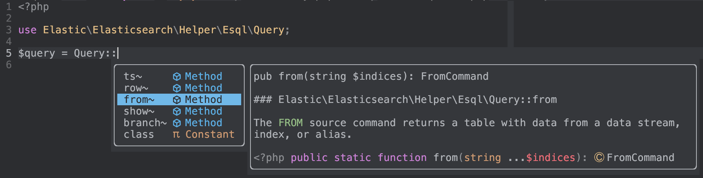
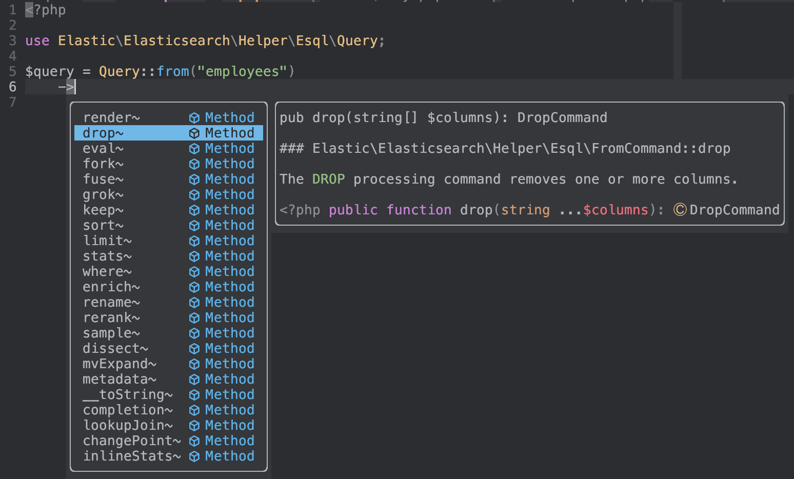

# ES|QL in the PHP client [esql]


This page helps you understand and use [ES|QL](docs-content://explore-analyze/query-filter/languages/esql.md) in the PHP client.

There are two ways to use ES|QL in the PHP client:

* Use the Elasticsearch [ES|QL API](https://www.elastic.co/docs/api/doc/elasticsearch/group/endpoint-esql) directly: This is the most flexible approach, but it’s also the most complex because you must handle results in their raw form. You can choose the precise format of results, such as JSON, CSV, or text.
* Use ES|QL `mapTo($class)` helper. This mapper takes care of parsing the raw response and converting into an array of objects. If you don’t specify the class using the `$class` parameter, the mapper uses [stdClass](https://www.php.net/manual/en/class.stdclass.php).

ES|QL queries can be given directly as regular strings or heredoc strings, or for a more convenient option you can use the [ES|QL query builder](#esql-query-builder) helper, which can define ES|QL queries using PHP code.

## How to use the ES|QL API [esql-how-to]

The [ES|QL query API](https://www.elastic.co/docs/api/doc/elasticsearch/group/endpoint-esql) allows you to specify how results should be returned. You can choose a [response format](docs-content://explore-analyze/query-filter/languages/esql-rest.md#esql-rest-format) such as CSV, text, or JSON, then fine-tune it with parameters like column separators and locale.

The default response from Elasticsearch is a table in JSON, where `columns` is an array of descriptions and `values` is an array of rows containing the values.

$$$query-script$$$
Here’s an example query and PHP script:

```php
$query = <<<EOD
    FROM books
    | WHERE author == "Stephen King"
    | SORT rating DESC
    | LIMIT 10
EOD;

$result = $client->esql()->query([
    'body' => ['query' => $query]
]);

foreach ($result['values'] as $value) {
    $i=0;
    foreach ($result['columns'] as $col) {
        printf("%s : %s\n", $col['name'], $value[$i++]);
    }
    print("---\n");
}
```

Here’s the JSON response from Elasticsearch:

```json
{
    "columns": [
        { "name": "author", "type": "text" },
        { "name": "description", "type": "text" },
        { "name": "publisher", "type": "keyword" },
        { "name": "rating", "type": "double" },
        { "name": "title", "type": "text" },
        { "name": "year", "type": "integer" }
    ],
    "values": [
        [
            "Stephen King",
            "The author ...",
            "Turtleback",
            5.0,
            "How writers write",
            2002
        ],
        [
            "Stephen King",
            "In Blockade Billy, a retired coach...",
            "Simon and Schuster",
            5.0,
            "Blockade",
            2010
        ],
        [
            "Stephen King",
            "A chilling collection of twenty horror stories.",
            "Signet Book",
            4.55859375,
            "Night Shift (Signet)",
            1979
        ],
        ...
    ]
}
```

Using this response, the PHP script (provided [above](#query-script)) produces the following output:

```php
author : Stephen King
description : The author ...
publisher : Turtleback
rating : 5.0
title : How writers write
year : 2002
---
author : Stephen King
description : In Blockade Billy, a retired coach...
publisher : Simon and Schuster
rating : 5.0
title : Blockade
year : 2010
---
author : Stephen King
description : A chilling collection of twenty horror stories.
publisher : Signet Book
rating : 4.55859375
title : Night Shift (Signet)
year : 1979
---
```

The following example gets ES|QL results as CSV and parses them:

```php
$result = $client->esql()->query([
    'format' => 'csv',
    'body' => ['query' => $query]
]);

var_dump($result->asArray());
```

The response looks something like this:

```json
array(12) {
  [0]=>
  array(6) {
    [0]=>
    string(6) "author"
    [1]=>
    string(11) "description"
    [2]=>
    string(9) "publisher"
    [3]=>
    string(6) "rating"
    [4]=>
    string(5) "title"
    [5]=>
    string(4) "year"
  }
  [1]=>
  array(6) {
    [0]=>
    string(12) "Stephen King"
    [1]=>
    string(249) "The author ..."
    [2]=>
    string(18) "Turtleback"
    [3]=>
    string(3) "5.0"
    [4]=>
    string(8) "How writers write"
    [5]=>
    string(4) "2002"
  }
```

In the response, the first row contains the column descriptions and the other rows contain the values, using a plain PHP array.


## Define your own mapping [esql-custom-mapping]

Although the `esql()->query()` API covers many use cases, your application might require a custom mapping.

You can map the ES|QL result into an array of objects, using the `mapTo()` function. Here’s an example:

```php
$result = $client->esql()->query([
    'body' => ['query' => $query]
]);

$books = $result->mapTo(); // Array of stdClass
foreach ($books as $book) {
    printf(
        "%s, %s, %d, Rating: %.2f\n",
        $book->author,
        $book->title,
        $book->year,
        $book->rating
    );
}
```

You can also specify a class name for the mapping. All the values will be assigned to the properties of the class.

Here’s an example mapper that returns an array of `Book` objects:

```php
class Book
{
    public string $author;
    public string $title;
    public string $description;
    public int $year;
    public float $rating;
}

$result = $client->esql()->query([
    'body' => ['query' => $query]
]);
$books = $result->mapTo(Book::class); // Array of Book
```

## Using the ES|QL query builder [esql-query-builder]

::::{warning}
This functionality is in technical preview and may be changed or removed in a future release. Elastic will work to fix any issues, but features in technical preview are not subject to the support SLA of official GA features.
::::

The ES|QL query builder allows you to construct ES|QL queries using PHP syntax. Consider the following example:

```php
use Elastic\Elasticsearch\Helper\Esql\Query;

$query = Query::from("employees")
    ->sort("emp_no")
    ->keep("first_name", "last_name", "height")
    ->eval(height_feet: "height * 3.281", height_cm: "height * 100")
    ->limit(3);
```

Casting this query object to a string returns the raw ES|QL query, which you can send to the Elasticsearch ES|QL API:

```php
$result = $client->esql()->query([
    'body' => ['query' => (string)$query]
]);
```

### Creating an ES|QL query

To construct an ES|QL query object you typically use `Query::from()`, although there are more [source commands](https://www.elastic.co/docs/reference/query-languages/esql/commands/source-commands) available. Here are some examples:

```php
// FROM employees
$query = Query::from("employees");

// FROM <logs-{now/d}>
$query = Query::from("<logs-{now/d}>");

// FROM employees-00001, other-employees-*
$query = Query::from("employees-00001", "other-employees-*");

// FROM cluster_one:employees-00001, cluster_two:other-employees-*
$query = Query::from("cluster_one:employees-00001", "cluster_two:other-employees-*");

// FROM employees METADATA _id
$query = Query::from("employees")->metadata("_id");
```

Note how in the last example the optional `METADATA` clause of the `FROM` command is added as a chained method.

### Adding processing commands

Once you have a query object, you can add one or more processing commands to it by chaining them. The following example shows how to create a query that uses the `WHERE` and `LIMIT` processing commands to filter the results:

```php
$query = Query::from("employees")
    ->where("still_hired == true")
    ->limit(10);
```

The ES|QL documentation includes the complete list of available [processing commands](https://www.elastic.co/docs/reference/query-languages/esql/commands/processing-commands).

### Using Code completion

You can rely on autocompletion as an aid in constructing ES|QL queries with the query builder. Note that this requires an IDE that is configured with a PHP language server.




